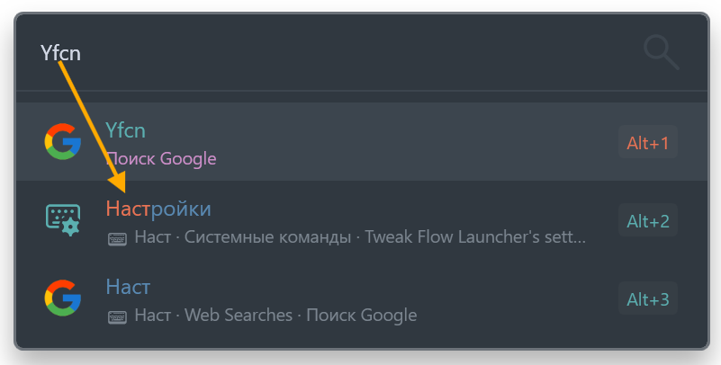

Layout Fallback adds lower-priority fallback results when a Flow Launcher query was typed using the wrong keyboard layout.

It does not translate, transliterate, autocorrect, or replace your query. Instead, it reinterprets the same physical key presses through the keyboard layouts installed on your Windows system and appends additional search results below the original Flow Launcher results.

**Examples:**

- `Yfcnhjqrb` -> additionally searches `Настройки`
- `руддщ` -> additionally searches `hello`

Original Flow Launcher results stay untouched and remain higher. Fallback results are marked with `⌨` and receive a strong score penalty.

## 🤓 Mechanics in detail

1. Reads installed Windows keyboard layouts with `GetKeyboardLayoutList`, `HKCU\Keyboard Layout\Preload`, and `HKCU\Keyboard Layout\Substitutes`.
2. Builds conversion maps between every ordered pair of available layouts.
3. Generates corrected query candidates and filters out weak or duplicate conversions.
4. Queries the other global Flow Launcher plugins with the corrected candidates.
5. Appends lower-priority fallback results without touching the original Flow Launcher results.

Explicit action-keyword queries are ignored, so the plugin only participates in ordinary global searches.

## 🌍 Supported keyboard layouts

Layout Fallback works best with direct keyboard layouts where the same physical keys produce different characters.

Best candidates include English US, English UK, Russian, Ukrainian, Belarusian, Bulgarian, Serbian Cyrillic, Macedonian, Kazakh, Kyrgyz, Mongolian Cyrillic, Greek, Hebrew, Arabic, Persian, Armenian, Georgian, and Thai.

Latin-based layouts may also work, but the benefit is usually smaller because many characters overlap with English.

Some layouts may have limited support because they rely on IME, dead keys, complex composition, AltGr-heavy input, or candidate selection.

## 📓 Notes

- Fallback output is limited to 20 results and 6 results per source plugin.
- Latin-to-Latin fallback candidates use a softer filter, but receive an extra score penalty and appear lower.
- Some third-party plugins may behave differently when queried indirectly, so fallback results can vary by source plugin.
- Layout Fallback does not translate or transliterate text. It only reinterprets the same physical key presses through other installed Windows keyboard layouts.