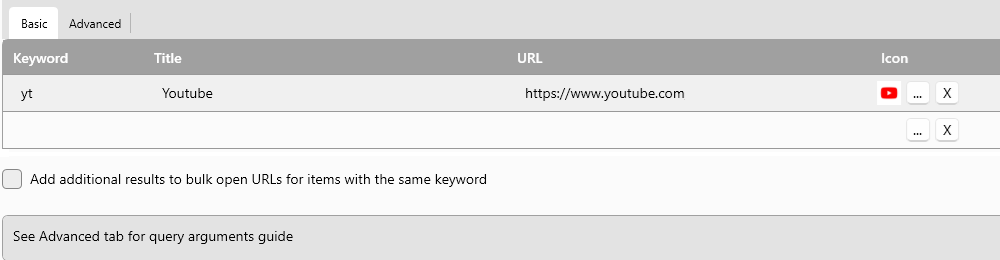
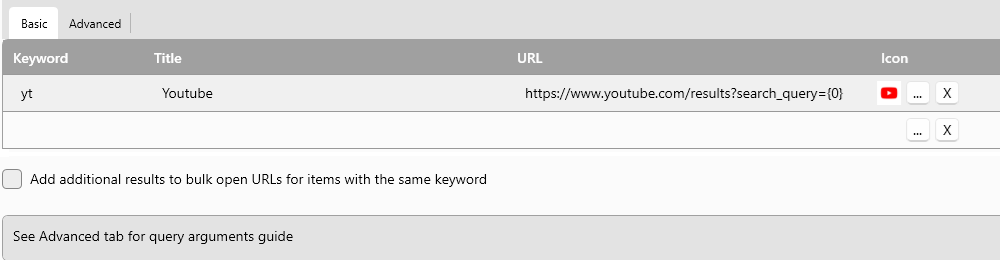
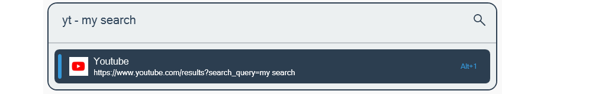
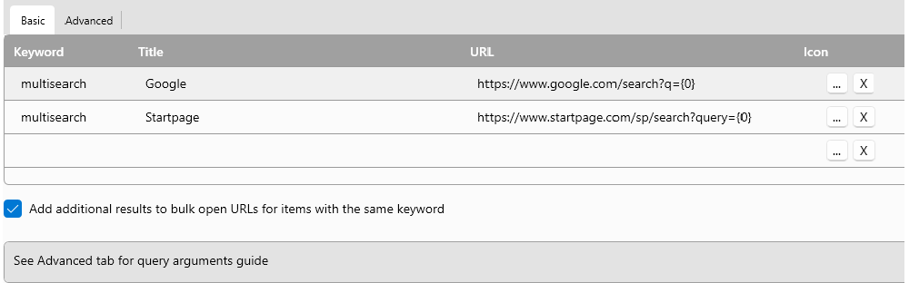
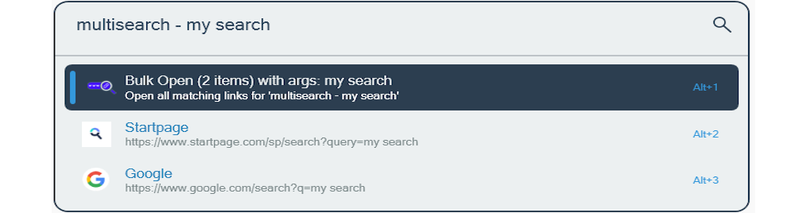

# Plugin

The LinkOpener plugin allows you to open links using predefined keywords set in the settings. This enhances productivity by enabling quick access to frequently used links.

# Usage

In the plugin settings, define your keyword (action trigger), title, and the URL you want to open. Once configured, the plugin will open this URL when you use the keyword.
The plugin supports different settings configurations to open links:

## Search Without Arguments

  
The result is:  
  
This configuration allows you to open links without additional arguments.

## Search With Arguments

  
The result is:  
  
This configuration allows you to open links with specific arguments, providing more flexibility.

## Multi-Search With Arguments

  
The result is:  
  
This configuration supports opening multiple links with arguments.

