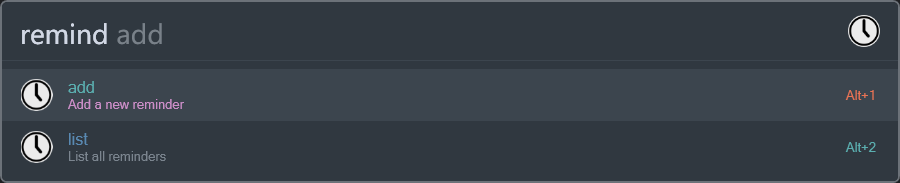
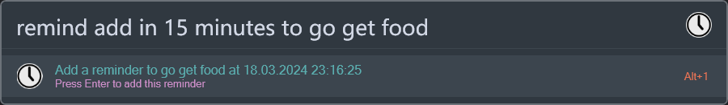
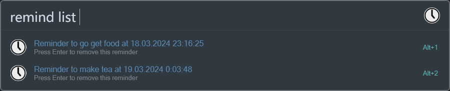

# Plugin

This plugin lets you set simple reminders at specific times.

> Please note that the reminders will not work if you close Flow Launcher.

## Usage

To use this plugin, type its action keyword (`remind` by default) followed by the command (either `add`, or `list`),
followed by command arguments.



### Add

To add a reminder, type `add` followed by the time and the message in the following format:

```js
add <time> to <message>
```

Time can be either relative:

```
in 5 minutes
in 1 hour
in 2 days
```

or absolute:

```
7 pm
19:00
2025-02-13
2025-02-13 15:00
```

Examples of valid commands:

```
remind add in 5 minutes to begin cooking the chicken
remind add in 1 hour to go to the gym
remind add 2025-01-20 to go buy some milk
```



### List

To list all your reminders, type `list`. This will display a list of all your reminders, with the time and the message.
You can select a reminder to delete it.



## Settings

The plugin has a few settings that you can change:

### Show notifications when adding or deleting reminders
  
When this setting is enabled, the plugin will show a notification every time you add or delete a reminder, just so
you're sure it worked.

### How to show reminders

You can choose between two different ways to show your reminders:

- Standard Windows notification  
  This could be somewhat easy to miss and might also not be available on all Windows versions.


- Always-on-top window  
  A window that always appears on top of everything else you do, forcing you to pay attention to it.

### Also accept new reminders in short form

When this setting is enabled, the plugin will also accept new reminders in the short form, which looks like this:

```
remind <time with message>
```

No command is required, and the time can be mixed with the message. The time must always be in this format:
`<digits><unit>`, i.e. `1h`, `5m`, `2d`, etc.

Examples of valid commands:

```yaml
# In 5 minutes:
remind 5m do stuff
remind do stuff 5m

# In 5 hours and 5 minutes:
remind 5h 5m do stuff

# In 5 hours, 5 minutes, and 15 seconds:
remind 5h do stuff 5m 15s

# In 1 week minus 12 hours:
remind 1w -12h do stuff

# In 1 week plus 5 minutes minus 12 hours:
remind 1w do stuff -12h 5m
```


As you can see, in the short form, you can specify the time and the message in any order.
