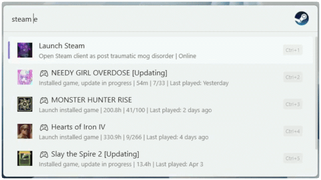
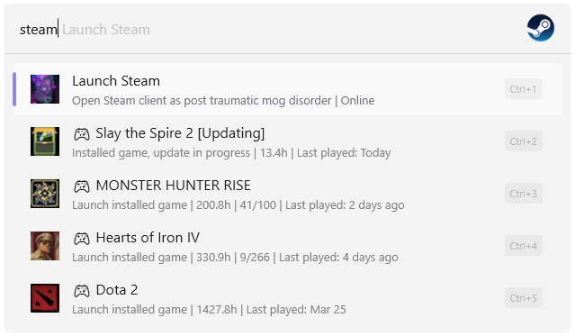
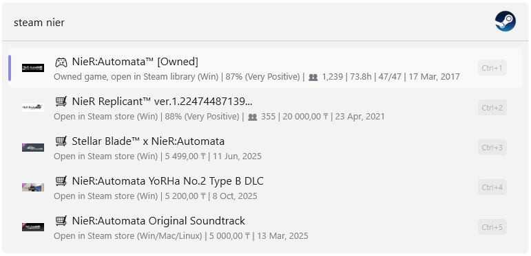
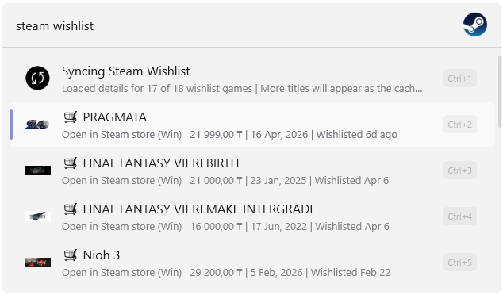
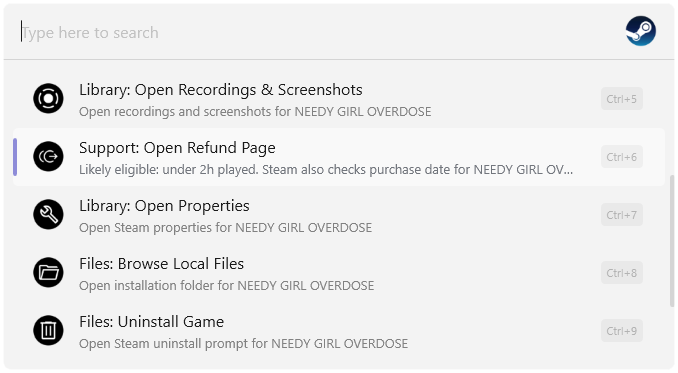
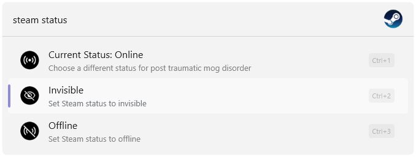
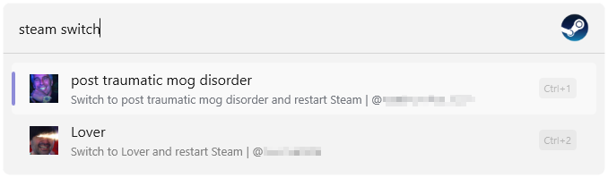

## Control Steam from Flow Launcher

### Commands

`steam ?`
`steam api`
`steam status`
`steam switch`
`steam wishlist`

## Features

### Local library

- Launch installed games directly from Flow Launcher
- Shows playtime, last played date, and achievement progress
- Live install/update status badges
- Sorted by most recently played

### Steam Store search

- Search the Steam store by game name
- Shows review score, concurrent player count, price, and release date
- Owned games opens directly in your library

### Wishlist

- Browse and search your Steam wishlist
- Shows current price, review score, and date added to wishlist
- Requires a Steam Web API key (`steam api` to configure)

### Adaptive context menu

- Open store page in Steam or [SteamDB](https://steamdb.info/)
- Open Community Guides and Discussions
- Open Recordings & Screenshots folder
- Open game Properties
- Browse local game files
- Check refund eligibility
- Install or Uninstall game

### Steam status

- Switch to Online, Invisible, or Offline in one click

### Account switcher

- Switch between Steam accounts signed in on this PC and restart Steam instantly